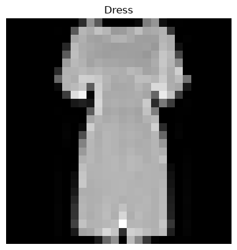
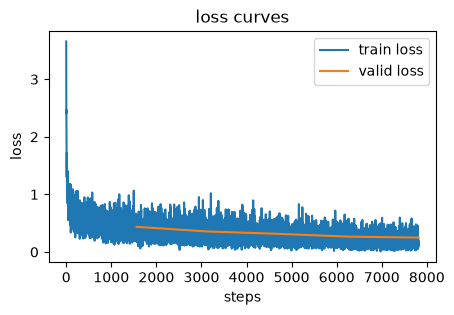

# core


<!-- WARNING: THIS FILE WAS AUTOGENERATED! DO NOT EDIT! -->

## Visualization Functions

``` python
def chunks(x, sz):
  for i in range(0, len(x), sz): yield x[i:i+sz]

def show_data(fashion_image, label=None, is_1d=False):
    if isinstance(fashion_image, tuple):
        fig, ax = plt.subplots(1, len(fashion_image), figsize=(9, 3))
        for i, x in enumerate(fashion_image):
            ax[i].imshow(x)
            ax[i].axis('off');
        plt.show()
    else:
        mpl.rcParams['image.cmap'] = 'gray'
        if label is not None:
            plt.title(f"{idx_to_class[label.item()]}")
        if is_1d==True:
            plt.imshow(list(chunks(fashion_image, 28)));
        else:
            plt.imshow(fashion_image);
        plt.axis('off');
```

## Load Fashion-MNIST

``` python
train_data = datasets.FashionMNIST(root="./data", train=True, download=True, transform=transforms.ToTensor())
test_data = datasets.FashionMNIST(root="./data", train=False, download=True, transform=transforms.ToTensor())
x_train_all = train_data.data[:, None, :, :]/255
y_train_all = train_data.targets

rand_idx = torch.randperm(x_train_all.shape[0])
x_train = x_train_all[rand_idx[:50_000]]
train_mean = x_train.mean()
train_std = x_train.std()

x_train = jnp.array((x_train - train_mean) / train_std)
y_train = jnp.array(y_train_all[rand_idx[:50_000]])
x_valid = jnp.array((x_train_all[rand_idx[50_000:]] - train_mean) / train_std)
y_valid = jnp.array(y_train_all[rand_idx[50_000:]])
x_test = jnp.array((test_data.data[:, None, :, :]/255 - train_mean) / train_std)
y_test = jnp.array(test_data.targets)

x_train.shape, y_train.shape, x_valid.shape, y_valid.shape, x_test.shape, y_test.shape,
```

    ((50000, 1, 28, 28),
     (50000,),
     (10000, 1, 28, 28),
     (10000,),
     (10000, 1, 28, 28),
     (10000,))

``` python
idx_to_class = {value: key for key, value in train_data.class_to_idx.items()}
num_classes = len(idx_to_class)
idx_to_class, num_classes
```

    ({0: 'T-shirt/top',
      1: 'Trouser',
      2: 'Pullover',
      3: 'Dress',
      4: 'Coat',
      5: 'Sandal',
      6: 'Shirt',
      7: 'Sneaker',
      8: 'Bag',
      9: 'Ankle boot'},
     10)

## DataLoaders

------------------------------------------------------------------------

<a
href="https://github.com/frenio/lucidlearn/blob/main/lucidlearn/core.py#L35"
target="_blank" style="float:right; font-size:smaller">source</a>

### Dataset

``` python
def Dataset(
    x, y
):
```

*Combines features and lables in a dataset.*

``` python
train_ds = Dataset(x_train, y_train)
valid_ds = Dataset(x_valid, y_valid)
test_ds = Dataset(x_test, y_test)
```

``` python
show_data(x_train[0].squeeze(), y_train[0])
```



------------------------------------------------------------------------

<a
href="https://github.com/frenio/lucidlearn/blob/main/lucidlearn/core.py#L42"
target="_blank" style="float:right; font-size:smaller">source</a>

### DataLoader

``` python
def DataLoader(
    dataset, batch_size:int=32, drop_last:bool=False, shuffle:bool=True,
    random_key:PRNGKeyArray=Array((), dtype=key<fry>) overlaying:
[ 0 42]
):
```

*Returns iterable batches from a dataset*

``` python
test_train_ds = Dataset(x_train[:-1], y_train[:-1])
```

``` python
test_dataloader = DataLoader(test_train_ds, batch_size = 2)
test_generator = iter(test_dataloader)
next(test_generator)
```

    (Array([[[[-0.8108199, -0.8108199, -0.8108199, ..., -0.8108199,
               -0.8108199, -0.8108199],
              [-0.8108199, -0.8108199, -0.8108199, ..., -0.8108199,
               -0.8108199, -0.8108199],
              [-0.8108199, -0.8108199, -0.8108199, ..., -0.8108199,
               -0.8108199, -0.8108199],
              ...,
              [-0.8108199, -0.8108199, -0.8108199, ..., -0.8108199,
               -0.8108199, -0.8108199],
              [-0.8108199, -0.8108199, -0.8108199, ..., -0.8108199,
               -0.8108199, -0.8108199],
              [-0.8108199, -0.8108199, -0.8108199, ..., -0.8108199,
               -0.8108199, -0.8108199]]],
     
     
            [[[-0.8108199, -0.8108199, -0.8108199, ..., -0.8108199,
               -0.8108199, -0.8108199],
              [-0.8108199, -0.8108199, -0.8108199, ..., -0.8108199,
               -0.8108199, -0.8108199],
              [-0.8108199, -0.8108199, -0.8108199, ..., -0.8108199,
               -0.8108199, -0.8108199],
              ...,
              [-0.8108199, -0.8108199, -0.8108199, ..., -0.8108199,
               -0.8108199, -0.8108199],
              [-0.8108199, -0.8108199, -0.8108199, ..., -0.8108199,
               -0.8108199, -0.8108199],
              [-0.8108199, -0.8108199, -0.8108199, ..., -0.8108199,
               -0.8108199, -0.8108199]]]], dtype=float32),
     Array([7, 0], dtype=int32))

``` python
len(test_dataloader)
```

    25000

``` python
test_dataloader = DataLoader(test_train_ds, batch_size = 2, drop_last=True)
test_generator = iter(test_dataloader)
next(test_generator)
```

    (Array([[[[-0.8108199, -0.8108199, -0.8108199, ..., -0.8108199,
               -0.8108199, -0.8108199],
              [-0.8108199, -0.8108199, -0.8108199, ..., -0.8108199,
               -0.8108199, -0.8108199],
              [-0.8108199, -0.8108199, -0.8108199, ..., -0.8108199,
               -0.8108199, -0.8108199],
              ...,
              [-0.8108199, -0.8108199, -0.8108199, ..., -0.8108199,
               -0.8108199, -0.8108199],
              [-0.8108199, -0.8108199, -0.8108199, ..., -0.8108199,
               -0.8108199, -0.8108199],
              [-0.8108199, -0.8108199, -0.8108199, ..., -0.8108199,
               -0.8108199, -0.8108199]]],
     
     
            [[[-0.8108199, -0.8108199, -0.8108199, ..., -0.8108199,
               -0.8108199, -0.8108199],
              [-0.8108199, -0.8108199, -0.8108199, ..., -0.8108199,
               -0.8108199, -0.8108199],
              [-0.8108199, -0.8108199, -0.8108199, ..., -0.8108199,
               -0.8108199, -0.8108199],
              ...,
              [-0.8108199, -0.8108199, -0.8108199, ..., -0.8108199,
               -0.8108199, -0.8108199],
              [-0.8108199, -0.8108199, -0.8108199, ..., -0.8108199,
               -0.8108199, -0.8108199],
              [-0.8108199, -0.8108199, -0.8108199, ..., -0.8108199,
               -0.8108199, -0.8108199]]]], dtype=float32),
     Array([7, 0], dtype=int32))

``` python
len(test_dataloader)
```

    24999

``` python
bs = 32

train_dl = DataLoader(train_ds, batch_size=bs, shuffle=True)
valid_dl = DataLoader(valid_ds, batch_size=bs, shuffle=True)
test_dl = DataLoader(test_ds, batch_size=bs, shuffle=False)
```

------------------------------------------------------------------------

<a
href="https://github.com/frenio/lucidlearn/blob/main/lucidlearn/core.py#L78"
target="_blank" style="float:right; font-size:smaller">source</a>

### DataLoaders

``` python
def DataLoaders(
    *dls
):
```

*Combines training and validation data in a DataLoaders object that can
be passed to a learner.*

``` python
dls = DataLoaders(train_dl, valid_dl)
dls.train, dls.valid
```

    (<__main__.DataLoader>,
     <__main__.DataLoader>)

``` python
one_batch = next(iter(dls.train))[0]
one_batch.shape
```

    (32, 1, 28, 28)

## Learner and Callbacks

------------------------------------------------------------------------

<a
href="https://github.com/frenio/lucidlearn/blob/main/lucidlearn/core.py#L85"
target="_blank" style="float:right; font-size:smaller">source</a>

### CancelEpochException

``` python
def CancelEpochException(
    *args, **kwargs
):
```

*Common base class for all non-exit exceptions.*

------------------------------------------------------------------------

<a
href="https://github.com/frenio/lucidlearn/blob/main/lucidlearn/core.py#L84"
target="_blank" style="float:right; font-size:smaller">source</a>

### CancelBatchException

``` python
def CancelBatchException(
    *args, **kwargs
):
```

*Common base class for all non-exit exceptions.*

------------------------------------------------------------------------

<a
href="https://github.com/frenio/lucidlearn/blob/main/lucidlearn/core.py#L83"
target="_blank" style="float:right; font-size:smaller">source</a>

### CancelFitException

``` python
def CancelFitException(
    *args, **kwargs
):
```

*Common base class for all non-exit exceptions.*

------------------------------------------------------------------------

<a
href="https://github.com/frenio/lucidlearn/blob/main/lucidlearn/core.py#L88"
target="_blank" style="float:right; font-size:smaller">source</a>

### with_cbs

``` python
def with_cbs(
    nm
):
```

*Initialize self. See help(type(self)) for accurate signature.*

------------------------------------------------------------------------

<a
href="https://github.com/frenio/lucidlearn/blob/main/lucidlearn/core.py#L101"
target="_blank" style="float:right; font-size:smaller">source</a>

### run_cbs

``` python
def run_cbs(
    cbs, method_nm, learn:NoneType=None
):
```

*Call self as a function.*

------------------------------------------------------------------------

<a
href="https://github.com/frenio/lucidlearn/blob/main/lucidlearn/core.py#L107"
target="_blank" style="float:right; font-size:smaller">source</a>

### Learner

``` python
def Learner(
    model, params, dls:tuple=(0,), loss_func:function=softmax_cross_entropy_with_integer_labels, lr:float=0.001,
    cbs:NoneType=None, opt:function=sgd
):
```

*Initialize self. See help(type(self)) for accurate signature.*

------------------------------------------------------------------------

<a
href="https://github.com/frenio/lucidlearn/blob/main/lucidlearn/core.py#L181"
target="_blank" style="float:right; font-size:smaller">source</a>

### Callback

``` python
def Callback(
    *args, **kwargs
):
```

*Initialize self. See help(type(self)) for accurate signature.*

------------------------------------------------------------------------

<a
href="https://github.com/frenio/lucidlearn/blob/main/lucidlearn/core.py#L184"
target="_blank" style="float:right; font-size:smaller">source</a>

### DeviceParallelCB

``` python
def DeviceParallelCB(
    preload_data:bool=False
):
```

*Initialize self. See help(type(self)) for accurate signature.*

------------------------------------------------------------------------

<a
href="https://github.com/frenio/lucidlearn/blob/main/lucidlearn/core.py#L204"
target="_blank" style="float:right; font-size:smaller">source</a>

### accuracy

``` python
def accuracy(
    preds, targs
):
```

*Call self as a function.*

------------------------------------------------------------------------

<a
href="https://github.com/frenio/lucidlearn/blob/main/lucidlearn/core.py#L209"
target="_blank" style="float:right; font-size:smaller">source</a>

### MetricsCB

``` python
def MetricsCB(
    *ms, **metrics
):
```

*Initialize self. See help(type(self)) for accurate signature.*

------------------------------------------------------------------------

<a
href="https://github.com/frenio/lucidlearn/blob/main/lucidlearn/core.py#L236"
target="_blank" style="float:right; font-size:smaller">source</a>

### OneCycleCB

``` python
def OneCycleCB(
    pct_start:float=0.3, div:int=25, final_div:float=10000.0
):
```

*Initialize self. See help(type(self)) for accurate signature.*

------------------------------------------------------------------------

<a
href="https://github.com/frenio/lucidlearn/blob/main/lucidlearn/core.py#L263"
target="_blank" style="float:right; font-size:smaller">source</a>

### LRRecorderCB

``` python
def LRRecorderCB():
```

*Initialize self. See help(type(self)) for accurate signature.*

------------------------------------------------------------------------

<a
href="https://github.com/frenio/lucidlearn/blob/main/lucidlearn/core.py#L282"
target="_blank" style="float:right; font-size:smaller">source</a>

### LossRecorderCB

``` python
def LossRecorderCB():
```

*Initialize self. See help(type(self)) for accurate signature.*

## Advanced Model Factory

### Layer Functions

------------------------------------------------------------------------

<a
href="https://github.com/frenio/lucidlearn/blob/main/lucidlearn/core.py#L351"
target="_blank" style="float:right; font-size:smaller">source</a>

### make_layernorm2d

``` python
def make_layernorm2d(
    key, num_features, eps:float=1e-05, offset:bool=True, ndims:int=4
):
```

*Call self as a function.*

------------------------------------------------------------------------

<a
href="https://github.com/frenio/lucidlearn/blob/main/lucidlearn/core.py#L342"
target="_blank" style="float:right; font-size:smaller">source</a>

### make_squeeze

``` python
def make_squeeze(
    key, dims:NoneType=None
):
```

*Call self as a function.*

------------------------------------------------------------------------

<a
href="https://github.com/frenio/lucidlearn/blob/main/lucidlearn/core.py#L328"
target="_blank" style="float:right; font-size:smaller">source</a>

### make_conv2d

``` python
def make_conv2d(
    key, cho, chi, ks:tuple=(3, 3), padding:str='SAME', strides:tuple=(1, 1), act_fn:custom_jvp=relu,
    initializer:function=he_normal, bias:bool=True, act:bool=True
):
```

*Call self as a function.*

------------------------------------------------------------------------

<a
href="https://github.com/frenio/lucidlearn/blob/main/lucidlearn/core.py#L314"
target="_blank" style="float:right; font-size:smaller">source</a>

### make_linear

``` python
def make_linear(
    key, fan_in, fan_out, act_fn:custom_jvp=relu, initializer:function=he_normal, bias:bool=True, act:bool=True
):
```

*Call self as a function.*

### Model Factory

------------------------------------------------------------------------

<a
href="https://github.com/frenio/lucidlearn/blob/main/lucidlearn/core.py#L369"
target="_blank" style="float:right; font-size:smaller">source</a>

### make_model

``` python
def make_model(
    key, model_dict, act_fn:custom_jvp=relu, bias:bool=True
):
```

*Call self as a function.*

``` python
model_dict = {'Conv2d_1':    {'make_fn': make_conv2d,     'args': (8, 1),      'kwargs': {'strides': (2, 2), 'act': True}},
              'LayerNorm_1': {'make_fn': make_layernorm2d,  'args': (8,),         'kwargs': {'ndims': 4}},
              'Conv2d_2':    {'make_fn': make_conv2d,     'args': (16, 8),     'kwargs': {'strides': (2, 2), 'act': True}},
              'LayerNorm_2': {'make_fn': make_layernorm2d,  'args': (16,),         'kwargs': {'ndims': 4}},
              'Conv2d_3':    {'make_fn': make_conv2d,     'args': (32, 16),    'kwargs': {'padding': 'VALID', 'strides': (2, 2), 'act': True}},
              'LayerNorm_3': {'make_fn': make_layernorm2d,  'args': (32,),         'kwargs': {'ndims': 4}},
              'Conv2d_4':    {'make_fn': make_conv2d,     'args': (64, 32),    'kwargs': {'padding': 'VALID', 'strides': (1, 1), 'act': True}},
              'LayerNorm_4': {'make_fn': make_layernorm2d,  'args': (64,),         'kwargs': {'ndims': 4}},
              'Squeeze' :    {'make_fn': make_squeeze,    'args': (),          'kwargs': {'dims': (2, 3)}},
              'Linear_1':    {'make_fn': make_linear,     'args': (64, num_classes), 'kwargs': {'act': False}}}
```

``` python
params, model = make_model(random_key, model_dict)
```

``` python
sum(p.size for p in jax.tree_util.tree_leaves(params))
```

    25274

``` python
model(params, one_batch).shape
```

    (32, 10)

## Training

``` python
dls = DataLoaders(train_dl, valid_dl)
params, model = make_model(random_key, model_dict)
metrics = MetricsCB(accuracy)
lr_rec = LRRecorderCB()
loss_rec = LossRecorderCB()
cbs = [DeviceParallelCB(), OneCycleCB(), metrics, lr_rec, loss_rec]
learn = Learner(model, params, dls, loss_func=optax.softmax_cross_entropy_with_integer_labels, lr=0.01, cbs=cbs, opt=optax.adamw)
```

``` python
learn.fit(5)
```

    Epoch       accuracy        loss    Mode
    ----------------------------------------
    0             0.8136      0.5246   train
    0             0.8400      0.4363    eval
    1             0.8671      0.3640   train
    1             0.8663      0.3555    eval
    2             0.8870      0.3031   train
    2             0.8876      0.3147    eval
    3             0.9078      0.2482   train
    3             0.9021      0.2663    eval
    4             0.9287      0.1894   train
    4             0.9114      0.2489    eval

``` python
loss_rec.plot()
```


