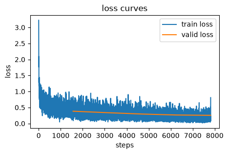

# lucidlearn


<!-- WARNING: THIS FILE WAS AUTOGENERATED! DO NOT EDIT! -->

## Installation

Install latest from the GitHub
[repository](https://github.com/frenio/lucidlearn):

``` sh
$ pip install git+https://github.com/frenio/lucidlearn.git
```

or from [pypi](https://pypi.org/project/lucidlearn/)

``` sh
$ pip install lucidlearn
```

## How to use

``` python
import lucidlearn.core as ll
import lucidlearn.nn as nn
```

### Other Imports

``` python
import jax
import jax.numpy as jnp
from jax import random
random_key = jax.random.key(42)

import optax

import torch
from torchvision import datasets, transforms
```

### Load Data (Fashion-MNIST)

``` python
train_data = datasets.FashionMNIST(root="./data", train=True, download=True, transform=transforms.ToTensor())
test_data = datasets.FashionMNIST(root="./data", train=False, download=True, transform=transforms.ToTensor())
x_train_all = train_data.data[:, None, :, :]/255
y_train_all = train_data.targets

rand_idx = torch.randperm(x_train_all.shape[0])
x_train = x_train_all[rand_idx[:50_000]]
train_mean = x_train.mean()
train_std = x_train.std()

x_train = jnp.array((x_train - train_mean) / train_std)
y_train = jnp.array(y_train_all[rand_idx[:50_000]])
x_valid = jnp.array((x_train_all[rand_idx[50_000:]] - train_mean) / train_std)
y_valid = jnp.array(y_train_all[rand_idx[50_000:]])
x_test = jnp.array((test_data.data[:, None, :, :]/255 - train_mean) / train_std)
y_test = jnp.array(test_data.targets)

x_train.shape, y_train.shape, x_valid.shape, y_valid.shape, x_test.shape, y_test.shape,
```

    ((50000, 1, 28, 28),
     (50000,),
     (10000, 1, 28, 28),
     (10000,),
     (10000, 1, 28, 28),
     (10000,))

``` python
idx_to_class = {value: key for key, value in train_data.class_to_idx.items()}
num_classes = len(idx_to_class)
idx_to_class, num_classes
```

    ({0: 'T-shirt/top',
      1: 'Trouser',
      2: 'Pullover',
      3: 'Dress',
      4: 'Coat',
      5: 'Sandal',
      6: 'Shirt',
      7: 'Sneaker',
      8: 'Bag',
      9: 'Ankle boot'},
     10)

### Create DataLoaders

``` python
train_ds = ll.Dataset(x_train, y_train)
valid_ds = ll.Dataset(x_valid, y_valid)
test_ds = ll.Dataset(x_test, y_test)
```

``` python
bs = 32

train_dl = ll.DataLoader(train_ds, batch_size=bs, shuffle=True)
valid_dl = ll.DataLoader(valid_ds, batch_size=bs, shuffle=True)
test_dl = ll.DataLoader(test_ds, batch_size=bs, shuffle=False)
```

``` python
dls = ll.DataLoaders(train_dl, valid_dl)
```

``` python
one_batch = next(iter(dls.train))[0]
one_batch.shape
```

    (32, 1, 28, 28)

### Define Model Dict and Build Model

``` python
model_dict = {'Conv2d_1':    {'make_fn': nn.make_conv2d,     'args': (8, 1),      'kwargs': {'strides': (2, 2), 'act': True}},
              'LayerNorm_1': {'make_fn': nn.make_layernorm2d,  'args': (8,),         'kwargs': {'ndims': 4}},
              'Conv2d_2':    {'make_fn': nn.make_conv2d,     'args': (16, 8),     'kwargs': {'strides': (2, 2), 'act': True}},
              'LayerNorm_2': {'make_fn': nn.make_layernorm2d,  'args': (16,),         'kwargs': {'ndims': 4}},
              'Conv2d_3':    {'make_fn': nn.make_conv2d,     'args': (32, 16),    'kwargs': {'padding': 'VALID', 'strides': (2, 2), 'act': True}},
              'LayerNorm_3': {'make_fn': nn.make_layernorm2d,  'args': (32,),         'kwargs': {'ndims': 4}},
              'Conv2d_4':    {'make_fn': nn.make_conv2d,     'args': (64, 32),    'kwargs': {'padding': 'VALID', 'strides': (1, 1), 'act': True}},
              'LayerNorm_4': {'make_fn': nn.make_layernorm2d,  'args': (64,),         'kwargs': {'ndims': 4}},
              'Squeeze' :    {'make_fn': nn.make_squeeze,    'args': (),          'kwargs': {'dims': (2, 3)}},
              'Linear_1':    {'make_fn': nn.make_linear,     'args': (64, num_classes), 'kwargs': {'act': False}}}
```

``` python
params, model = ll.make_model(random_key, model_dict)
```

``` python
sum(p.size for p in jax.tree_util.tree_leaves(params))
```

    25274

``` python
model(params, one_batch).shape
```

    (32, 10)

### Training

``` python
metrics = ll.MetricsCB(ll.accuracy)
lr_rec = ll.LRRecorderCB()
loss_rec = ll.LossRecorderCB()
cbs = [ll.DeviceParallelCB(), ll.OneCycleCB(), metrics, lr_rec, loss_rec]
learn = ll.Learner(model, params, dls, loss_func=optax.softmax_cross_entropy_with_integer_labels, lr=0.01, cbs=cbs, opt=optax.adamw)
```

``` python
learn.fit(5)
```

    Epoch       accuracy        loss    Mode
    ----------------------------------------
    0             0.8130      0.5247   train
    0             0.8596      0.3827    eval
    1             0.8677      0.3623   train
    1             0.8817      0.3375    eval
    2             0.8913      0.2978   train
    2             0.8914      0.2952    eval
    3             0.9104      0.2413   train
    3             0.9054      0.2648    eval
    4             0.9327      0.1840   train
    4             0.9099      0.2552    eval

``` python
loss_rec.plot()
```


